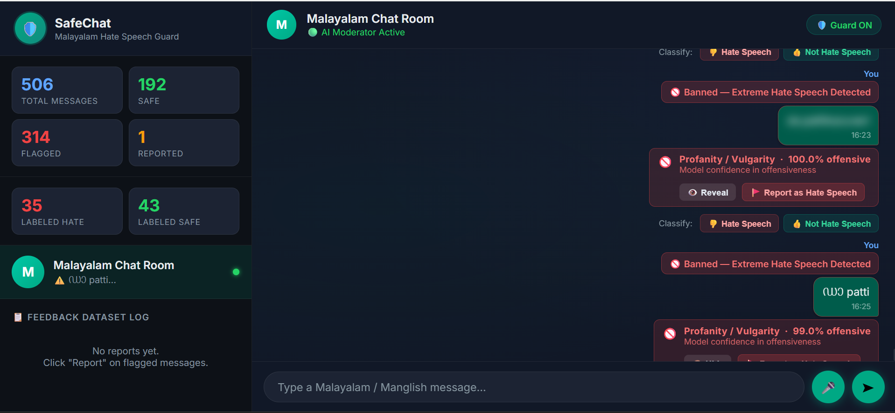
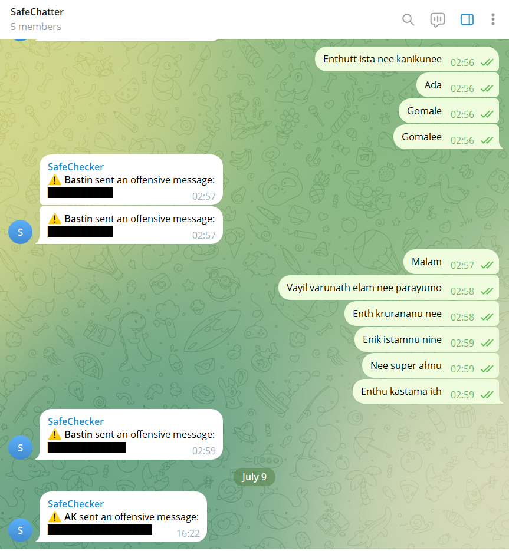

# SafeChat
**Context-Aware Hate Speech Detection Platform for Code Mixed and Malayalam**

SafeChat is an advanced AI-powered moderation system specifically built to detect and filter offensive, toxic, and hate speech in Malayalam and Code-Mixed 

Traditional moderation bots struggle with "Code-Mixed" languages (e.g., Malayalam written in English letters) because they rely on simple keyword blocking. SafeChat solves this by using a deep-learning AI brain (MuRIL) that actually understands the *context* of a sentence, allowing it to differentiate between a friendly slang word and a toxic insult. 

It actively monitors chat rooms (via a Web App or Telegram Bot) and intercepts offensive text and voice notes in real-time.

---

### Key Features
* **Telegram Bot Integration**: Acts as an automated group admin on Telegram, instantly deleting or censoring toxic messages the moment they are sent.
* **Web Chat Interface**: A modern, real-time web application where users can chat safely. The AI acts as a live moderator, replacing offensive words with censor bars and providing a percentage confidence score on toxicity.
* **Voice Note Processing (STT)**: Uses Whisper Speech-to-Text to actively transcribe and moderate voice messages sent in chat.
* **Context-Aware AI**: Powered by a heavily fine-tuned MuRIL model that understands conversational Manglish, native Malayalam script, and English.

---

### Technical Specifications
* **Based on** : MuRIL (Multilingual Representations for Indian Languages) AI engine
* **Multi-Lingual recognition** : English + Malayalam (Code-Mixed / Manglish) + Native Malayalam Script
* **Input methods** : Text messages, Voice Notes (Audio)
* **Output actions** : Moderated Text, Telegram Censor Bars, Real-time API response

## Prerequisites
To run this project locally, you will need:
* **Python 3.8+** installed on your system.
* **FFmpeg** installed and added to your system PATH (required for processing Voice Notes).
* A valid **Telegram Bot Token** (if using the Telegram integration).

## Dependencies
* Python 3.8+
* FFmpeg
* PyTorch & Transformers (HuggingFace)
* PyPI dependencies listed in `requirements.txt`

Installation of PyPI dependencies:
```bash
pip install -r requirements.txt  
```

## Built With
* **MuRIL** : The underlying NLP framework used for the AI brain
* **Whisper STT** : Used for Speech-to-Text transcription of voice notes
* **Flask** : Web Development and API server backend
* **python-telegram-bot** : Telegram integration

## Creators
* **Bastin George** – Student Intern, ICFOSS

## Mentor And Contributor
* **Albin D. Mamachen** – ML/DL Intern, Language Technology, ICFOSS 

## Project Guidance and Support
* **Dr. Rajeev R. R.** – Programme Head, Language Technology, ICFOSS

## Developers
This project is Developed by **Bastin George, ICFOSS**

---

## Screenshots
**Web UI Chat Section**

*(The real-time web interface where the AI flags hate speech and applies censor bars.)*

**Telegram Bot Moderation**

*(The Telegram bot actively monitoring a group and warning users for offensive messages.)*

## License
This project is licensed under the GNU - GPL v3 - see the (https://www.gnu.org/licenses/gpl-3.0.en.html) file for details.
